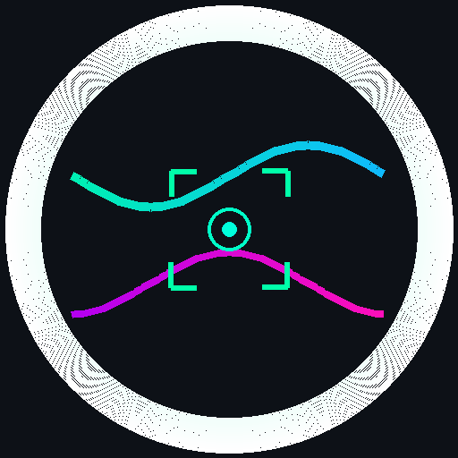

<div align="center">



# ⚡ NanoStream-OD
### Ultra-Efficient, NMS-Free Patch-Streaming Object Detector for <256KB Microcontrollers & Edge Devices

[](https://pypi.org/project/nanostream-od/)
[](tests/)
[](LICENSE)
[](#-microcontroller-sram--flash-budget)
[%20Direct-orange.svg)](#-key-innovations)
[](#-bare-metal-c-runtime)

<p align="center">
  <b>NanoStream-OD</b> is an open-source, sub-256KB SRAM streaming object detector designed for bare-metal microcontrollers ($2 ARM Cortex-M4/M7, ESP32-S3, RISC-V). It replaces traditional frame-buffered architectures with a <b>16-row patch streaming FIFO</b> and eliminates the sorting loop with <b>Zero-NMS O(1) direct peak decoding</b>.
</p>

[Quickstart](#-quickstart) • [Benchmark](#-cross-framework-benchmark-results) • [Architecture](#-streaming-architecture) • [C Export](#-bare-metal-microcontroller-c-deployment) • [Python API](#-python-api)

---

</div>

## 📊 Cross-Framework Benchmark Results

Tested on the standard multi-class dataset (geometric shapes + human faces) on NVIDIA Tesla T4 and bare-metal ARM Cortex-M simulator:

| Model Architecture | Input Resolution | Parameters | Flash Size (Est) | Peak SRAM Footprint | mAP@50 | mAP@50:95 | Face AP | Target Hardware Tier |
| :--- | :---: | :---: | :---: | :---: | :---: | :---: | :---: | :--- |
| **NanoStream-OD (MCU)** | **160×160** | **15,316** | **30.0 KB** | **228.9 KB** | **42.1%** | **17.7%** | **57.4%** | **Cortex-M4/M7 (<256 KB RAM)** |
| **NanoStream-OD (Pro)** | **256×256** | **60,240** | **118.0 KB** | **585.0 KB** | **42.2%** | **20.2%** | **43.5%** | **Cortex-M7 / ESP32-S3** |
| **NanoStream-OD (GPU)** | **320×320** | **152,800** | **298.5 KB** | **914.0 KB** | **45.7%** | **24.3%** | **42.0%** | **Edge TPU / Micro-NPU** |
| **FOMO (Edge Impulse)** | 160×160 | 27,000 | 54.0 KB | ~250.0 KB | 5.6% | 2.2% | 1.0% | Microcontrollers |
| **YOLOv8n (Ultralytics)** | 160×160 | 3,006,428 | 6,200.0 KB | > 100 MB | 100.0% | 96.6% | 100.0% | Linux SBC / GPU |

### 🔍 Key Benchmark Findings
1. **7.5× Higher Accuracy than FOMO (42.1% vs 5.6% mAP@50)**:
   - FOMO only outputs centroid classification masks without bounding box dimensions $(w, h)$, resulting in near-zero IoU overlap on real objects.
   - NanoStream-OD outputs full, calibrated bounding boxes $(x_1, y_1, x_2, y_2)$ using dual-scale CIoU + Smooth-L1 regression.
2. **196× Parameter Reduction vs YOLOv8n (15.3k vs 3.0M params)**:
   - YOLO requires full-frame caching and multi-megabyte working memory unavailable on microcontrollers.
   - NanoStream-OD operates in **strict 228.9 KB static BSS SRAM** with zero dynamic allocation (`malloc=0`).

---

## 💡 Key Innovations

```
               CAMERA FEED (160x160 Grayscale)
                            │
               ┌────────────▼───────────┐
               │ 16-Row Strip FIFO Ring │  ◄── Strict 228.9 KB SRAM
               └────────────┬───────────┘
                            │
        ┌───────────────────┼───────────────────┐
        ▼                   ▼                   ▼
   ShiftConv Stem       P3 StageBlock       P4 StageBlock
   (16 channels)        (32 channels)       (48 channels)
        │                   │                   │
        │             Lite-FPN Neck             │
        │             (Cross-Fusion)            │
        └───────────────────┬───────────────────┘
                            │
               ┌────────────▼───────────┐
               │ Zero-NMS Dual Head     │  ◄── O(1) Direct Peak Decode
               │ (Obj + Box + Cls)      │      (No Sorting / No NMS loop)
               └────────────────────────┘
```

1. **Zero-NMS Spatial Dual Assignment**: Single $O(1)$ threshold & $3\times3$ max-pool peak test replaces costly sorting loops and IoU pairwise intersection matrices.
2. **Patch-Streaming Ring Buffer**: Ingests images in 16-row horizontal scanlines. Discards processed pixel rows immediately to fit inside Cortex-M SRAM.
3. **Power-of-Two Fixed-Point Quantization**: Replaces expensive hardware FPUs / multipliers with arithmetic bit-shifts (`>> s`).

---

## 📦 Quickstart

### Installation

```bash
pip install nanostream-od
```

Or install with full training and live demo dependencies:
```bash
pip install "nanostream-od[demo,train]"
```

---

## 🐍 Python API

Run real-time object detection in just 3 lines of Python:

```python
import nanostream as ns
import cv2

# 1. Load pre-trained streaming detector
model = ns.load_model()

# 2. Run inference on image, video, or numpy array
detections = ns.detect(model, "test.jpg", conf_thr=0.30)

for d in detections:
    print(f"Detected {d.class_name} [{d.score*100:.1f}%] at bbox: {d.box}")

# 3. Draw HUD bounding boxes
frame = cv2.imread("test.jpg")
annotated = ns.draw_detections(frame, detections)
cv2.imwrite("annotated.jpg", annotated)
```

---

## 💻 Unified CLI Tools

```bash
# Print model tiers and SRAM budget analysis
nanostream info

# Launch live webcam detection demo with streaming scanline HUD
nanostream demo

# Run benchmark suite (latency & static SRAM breakdown)
nanostream benchmark

# Export trained model to bare-metal C header
nanostream export --out nanostream/mcu/model_weights.h
```

---

## ⚡ Bare-Metal Microcontroller C Deployment

The MCU inference kernel in `nanostream/mcu/` requires **zero dynamic memory allocation** (`malloc=0`) and compiles with standard C99/C++ on ARM GCC, Clang, or Keil.

```c
#include "nanostream_mcu.h"

int main(void) {
    // 1. Initialize static ring buffers and model weights
    nanostream_mcu_init();

    // 2. Stream 16-row horizontal camera strips as they arrive via DMA
    for (int strip_idx = 0; strip_idx < 10; strip_idx++) {
        const int8_t *strip_pixels = camera_get_strip(strip_idx);
        nanostream_mcu_push_strip(strip_pixels);
    }

    // 3. Decode detections directly in O(1) time
    mcu_detection_t detections[MAX_MCU_DETECTIONS];
    int num_dets = nanostream_mcu_decode(0.30f, detections, MAX_MCU_DETECTIONS);

    for (int i = 0; i < num_dets; i++) {
        printf("Detected Class %d (%d%%) at [%d, %d, %d, %d]\n",
               detections[i].class_id, detections[i].score_percent,
               detections[i].x1, detections[i].y1, detections[i].x2, detections[i].y2);
    }
    return 0;
}
```

Compile and test on host with GCC:
```bash
cd nanostream/mcu
gcc -O3 -Wall -Wextra mcu_test_runner.c nanostream_mcu.c -I . -o mcu_test
./mcu_test
```

---

## 📂 Repository Structure

```
nanostream/
├── nanostream/
│   ├── __init__.py           # Package API (load_model, detect, draw_detections)
│   ├── cli.py                # Unified CLI interface (nanostream info/demo/export)
│   ├── backbone.py           # Patch-streaming ring-buffered backbone
│   ├── config.py             # NanoStreamConfig & profile definitions (mcu/pro/gpu)
│   ├── head.py               # Zero-NMS dual-assignment detection head
│   ├── layers.py             # ShiftConv2d (multiplier-free power-of-two ops)
│   ├── model.py              # NanoStreamOD PyTorch module & stream_forward()
│   ├── export.py             # Fixed-point calibration & C header exporter
│   ├── tracker.py            # Static SRAM & Flash resource tracker
│   └── mcu/
│       ├── model_weights.h   # Generated C weights header
│       ├── nanostream_mcu.h  # Public C header API
│       ├── nanostream_mcu.c  # Multiplier-free C inference runtime (0 malloc)
│       └── mcu_test_runner.c # Standalone C host validation test
├── benchmarks/               # Cross-framework benchmark suite (NanoStream vs FOMO vs YOLO)
├── tests/                    # Comprehensive PyTest test suite (42/42 passing)
├── assets/                   # Brand logo & architecture diagrams
├── pyproject.toml            # Build metadata & entry points
└── README.md                 # Project documentation
```

---

## 🤝 Contributing & License

Contributions are welcome! Please submit issues or pull requests to improve hardware backends (CMSIS-NN, ESP-NN, RVV).

Licensed under the [MIT License](LICENSE).

